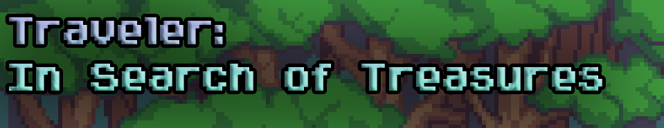
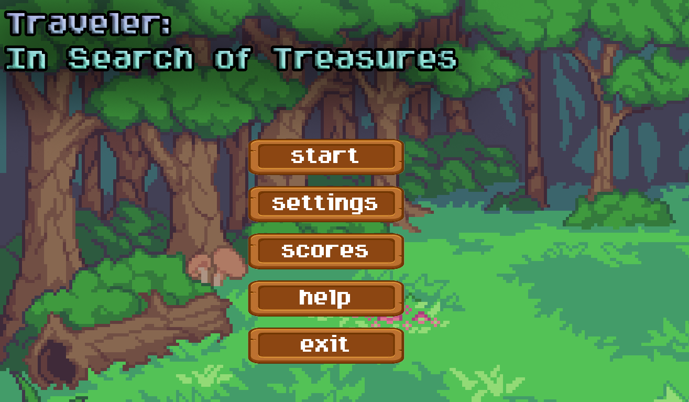
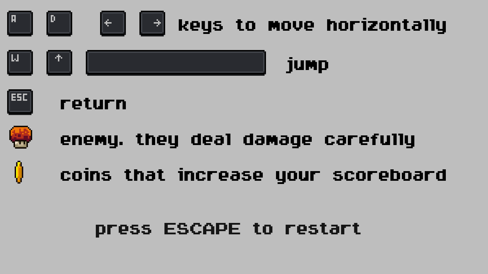
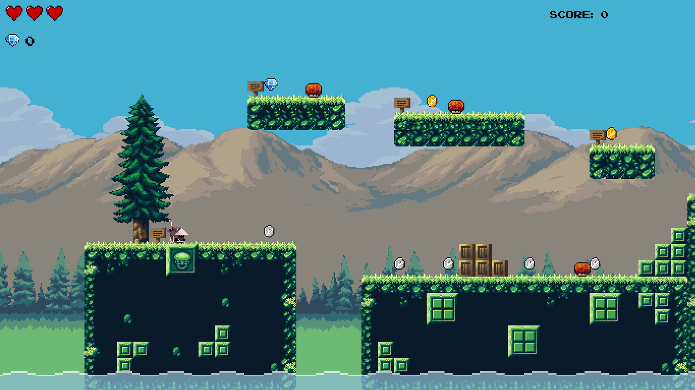
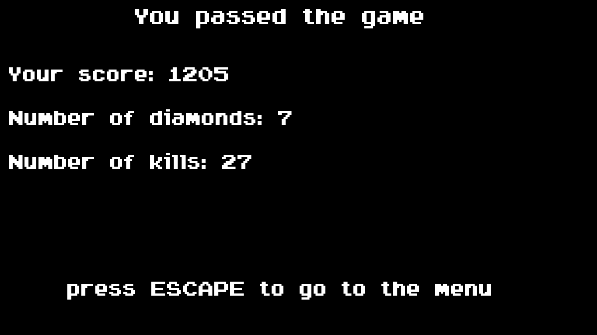

# 
Traveller: In Search of Treasures
========================

## Оглавление

0. [Запуск](#Запуск)
1. [Управление](#Управление)
2. [Особенности проекта и геймплея](#Особенности-проекта-и-геймплея)
3. [Внешний вид](#Внешний-вид)
4. [Видео](#Видео)

## Запуск:

Перед запуском проекта установите необходимые зависимости

```bash
  pip install -r requirements.txt
```

## Управление:

* Управление осуществляется курсорными клавишами `↑`, `↓` `←`, `→`, а также клавишами `W`, `A`, `S`, `D` и `SPACE` для
  прыжка.
* Пауза во время игры `ESC`
* Запустить игру по новой после смерти `SPACE`

## Особенности проекта

* Проект написан на `pygame2.1.0` с использованием языка `Python 3.9`

* Реализована регулировка громкости из меню.

* Уровни создавались в отдельном приложении Tiled Map Editor, что позволило сделать нам достаточно красивый интерфейс

* Количество уровней в игре равно 6.

* Всего в игре использовалось 16 классов

* При прохождении игры вы увидите 3 локации

* Во время игры вы увидите монетки и алмазы, за которые вам дадут определенное количество очков

* Если у вас осталось мало здоровья, то вы можете подобрать аптечки, которые разбросаны по карте

* Игрок перед началом игры может задать свое имя, и это имя будет сохранено в таблице результатов.

* В таблице результатов сохраняется только игрок, который попал в 10 сильнейших.

## Внешний вид
 
 

[:arrow_up:Оглавление](#Оглавление)

## Видео
[](https://www.youtube.com/watch?v=03uak1895JU)
[:arrow_up:Оглавление](#Оглавление)
